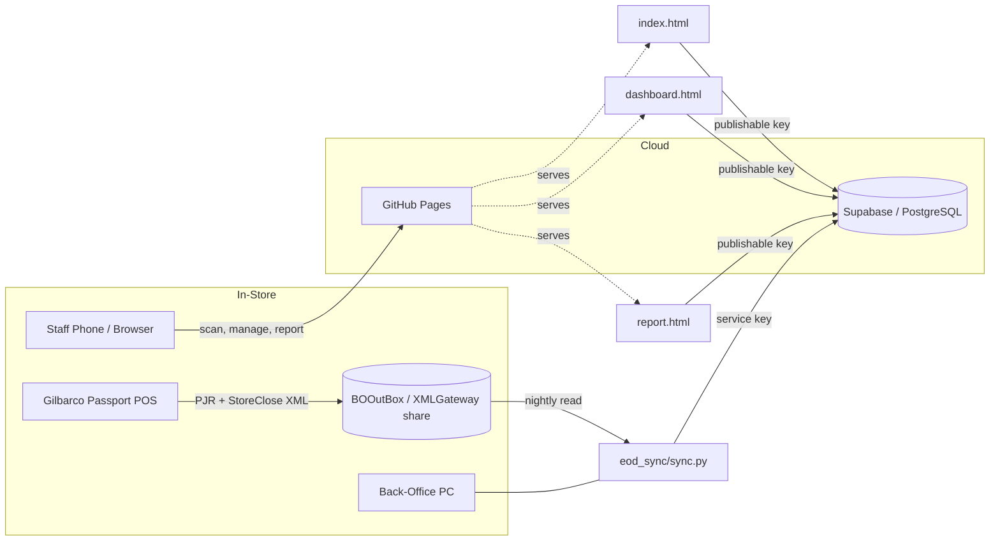
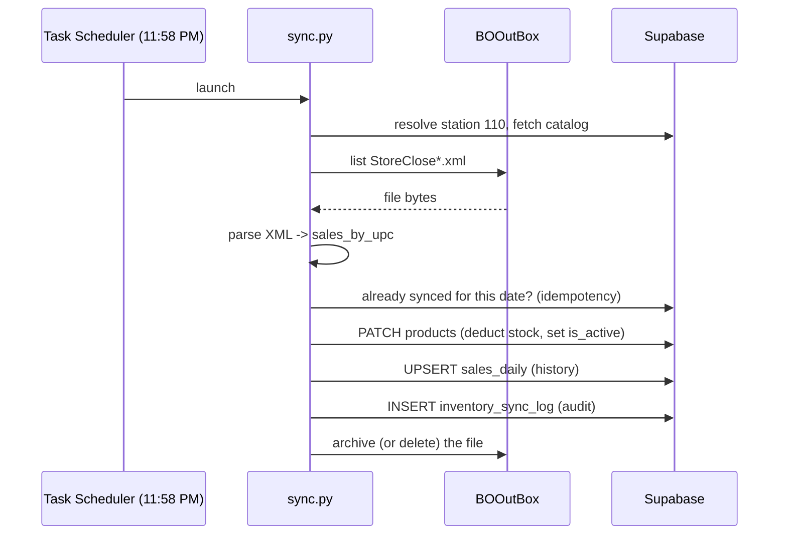

# QuikPick Inventory System — Technical White Paper

**A barcode-driven, POS-integrated inventory platform for gas-station click-and-collect**

| | |
|---|---|
| **System** | QuikPick Inventory Management (Phase 1) |
| **Pilot site** | StoreLocationID 110 — Gilbarco Passport, NAXML v3.4 |
| **Repository** | `github.com/DhruvKhanna1310/inventory-sys` |
| **Live tools** | `https://dhruvkhanna1310.github.io/inventory-sys/` |
| **Status** | Foundation deployed; EOD sync pending in-store deployment |
| **Document revision** | 1.0 — 2026-06-29 |

---

## Abstract

QuikPick is the inventory foundation for a gas-station click-and-collect application. Before any customer-facing ordering can exist, the store must maintain an accurate, automatically-updated record of what is on the shelf. This paper documents the Phase 1 system that achieves this: a zero-build-step web toolset for catalog construction and stock management, a PostgreSQL backend on Supabase, and a nightly reconciliation engine that consumes Gilbarco Passport point-of-sale journals to keep digital stock counts aligned with physical reality. The system is deliberately small, dependency-light, and operable by non-technical store staff. Each significant code block is presented and explained, alongside the architectural and security rationale behind it.

## Table of Contents

1. [Introduction & Motivation](#1-introduction--motivation)
2. [System Architecture](#2-system-architecture)
3. [Data Model](#3-data-model)
4. [Component A — Catalog Scanner](#4-component-a--catalog-scanner-indexhtml)
5. [Component B — Staff Dashboard](#5-component-b--staff-dashboard-dashboardhtml)
6. [Component C — Sales Report](#6-component-c--sales-report-reporthtml)
7. [Component D — EOD Reconciliation Engine](#7-component-d--eod-reconciliation-engine-eod_syncsyncpy)
8. [Gilbarco Passport Integration](#8-gilbarco-passport-integration)
9. [Security Model](#9-security-model)
10. [Operational Workflows](#10-operational-workflows)
11. [Demand Forecasting Roadmap](#11-demand-forecasting-roadmap)
12. [Deployment](#12-deployment)
13. [Limitations & Future Work](#13-limitations--future-work)
14. [Appendix — File Inventory](#14-appendix--file-inventory)

---

## 1. Introduction & Motivation

A click-and-collect application is only as trustworthy as its inventory. If the app shows a customer that a product is available when the last unit was sold to a walk-in customer thirty seconds earlier, the experience fails. The central engineering problem of Phase 1 is therefore **inventory truth**: a digital stock count that tracks physical stock without manual recounting.

Two forces continuously change physical stock:

1. **Walk-in sales** at the Gilbarco Passport register, which are invisible to any external system unless its journals are read.
2. **Deliveries and manual corrections** performed by staff.

QuikPick addresses (1) with an automated nightly reconciliation against the POS journal, and (2) with a staff dashboard. A one-time catalog-construction tool seeds the database. The design constraints were explicit: **no build step, minimal dependencies, and operability by store staff** rather than engineers.

## 2. System Architecture

The system spans three execution environments — the browser, the Supabase cloud, and the in-store back-office PC — connected as follows.



**Design tenets**

- **No framework, no build step.** All three front-end tools are single HTML files using vanilla JavaScript and CDN-hosted libraries (`@supabase/supabase-js`, `html5-qrcode`, `chart.js`). They can be edited with a text editor and served as static files.
- **Pure standard library on the edge.** The reconciliation engine uses only the Python standard library (`urllib`, `ftplib`, `xml.etree`), so deployment on the store PC requires nothing beyond a Python 3 install — no `pip`, no virtual environment.
- **A clean trust boundary.** Browser tools authenticate with a public *publishable* key constrained by Row Level Security; the trusted backend job authenticates with a *secret* key that bypasses it. This split is detailed in §9.

## 3. Data Model

The schema is PostgreSQL on Supabase. The table central to Phase 1 is `products`.

```sql
create table products (
  id uuid primary key default gen_random_uuid(),
  station_id uuid references stations(id),
  upc text,
  passport_item_id text,
  plu_code text,
  name text not null,
  passport_description text,
  price decimal(10,2) not null default 0.00,
  category text default 'other',
  merchandise_code int,
  stock_quantity int not null default 0,
  buffer_threshold int not null default 2,
  is_active boolean default true,
  image_url text,
  last_synced_at timestamptz,
  manual_override boolean default false,
  created_at timestamptz default now()
);
```

Three columns encode the visibility logic that the rest of the system orbits:

- **`stock_quantity`** — the current on-hand count.
- **`buffer_threshold`** — a safety floor (default 2). When stock falls to or below this, the item should disappear from the customer app, so the last units are reserved for in-store walk-ins and never oversold online.
- **`is_active`** — whether the product is offered to customers.
- **`manual_override`** — a flag asserting that staff have *deliberately* set `is_active`, so automated processes must not flip it back.

### 3.1 Sales History (Migration 001)

The original schema records only the *current* stock snapshot. To enable reporting and forecasting, migration 001 introduces a per-product, per-day sales ledger.

```sql
create table if not exists sales_daily (
  id uuid primary key default gen_random_uuid(),
  station_id uuid references stations(id),
  product_id uuid references products(id) on delete set null,
  upc text,
  product_name text,                       -- snapshot, survives renames/removals
  sale_date date not null,
  quantity_sold int not null default 0,
  unit_price decimal(10,2) not null default 0.00,  -- price snapshot -> revenue = qty * unit_price
  created_at timestamptz default now(),
  unique (product_id, sale_date)           -- one row per product per day; enables idempotent upsert
);
```

Two decisions are notable. First, `product_name` and `unit_price` are **snapshotted** at write time rather than joined live, so a historical report remains accurate even if a product is later renamed, repriced, or removed — the same pattern used by the `order_items` table. Second, the `unique (product_id, sale_date)` constraint is what makes the nightly writer idempotent: re-processing a day overwrites that day's row rather than appending a duplicate (see §7.4).

## 4. Component A — Catalog Scanner (`index.html`)

The scanner is the catalog-construction tool. Staff walk the store, scan each barcode, and the tool auto-fills product metadata from public APIs before saving to Supabase.

### 4.1 Backend connection

```javascript
const SUPABASE_URL = 'https://dwewijcyvmkhtrjdukqf.supabase.co';
const SUPABASE_KEY = 'sb_publishable_...';   // public, RLS-constrained
const { createClient } = supabase;
const db = createClient(SUPABASE_URL, SUPABASE_KEY);
```

The publishable key is embedded in client source deliberately; it is designed to be public and is constrained by Row Level Security (§9).

### 4.2 Scan handling and duplicate guard

On a successful decode, the UPC is normalized to digits and checked against the existing catalog before any network lookup, preventing accidental double-entry of the same product.

```javascript
async function onScanSuccess(upc) {
  await stopScanner();
  upc = upc.replace(/\D/g, '');
  if (upc.length < 8) { showToast('Invalid barcode. Try again.', true); return; }

  currentUPC = upc;
  const { data: existing } = await db
    .from('products').select('*').eq('upc', upc).eq('station_id', stationId).limit(1);
  if (existing && existing.length > 0) {
    showToast(`Already scanned: ${existing[0].name}`, false);
    return;
  }
  showLoading('Looking up product...');
  await lookupProduct(upc);
}
```

### 4.3 Two-tier UPC lookup

Product metadata is resolved against Open Food Facts first and UPC Item DB as a fallback; if neither resolves, the form opens for manual entry. This degradation is silent and never blocks the operator.

```javascript
// Open Food Facts (primary)
const res = await fetch(`https://world.openfoodfacts.org/api/v0/product/${upc}.json`);
const data = await res.json();
if (data.status === 1 && data.product) { /* populate form */ }
// ... else UPC Item DB (fallback) ... else manual entry
```

### 4.4 Persisting a product

The save path encodes a key business rule directly: a product is only made active if its quantity exceeds the buffer threshold.

```javascript
const product = {
  station_id: stationId,
  upc: currentUPC,
  name, price, category,
  stock_quantity: qty,
  buffer_threshold: 2,
  is_active: qty > 2,          // never list an item that is already at/below buffer
  image_url: currentImageUrl,
  manual_override: false,
};
const { data, error } = await db.from('products').insert([product]).select();
```

## 5. Component B — Staff Dashboard (`dashboard.html`)

The dashboard is the manual-control surface: staff view the catalog, correct quantities after deliveries, and toggle items in or out of the customer app. Because the publishable key cannot `DELETE` under the configured RLS (§9), all management is expressed through `UPDATE` operations rather than destructive deletes — a constraint that also makes the interface safer.

### 5.1 Quantity / price save with buffer-aware visibility

The single most important behavior in the dashboard is how a stock edit interacts with visibility. The rule: a quantity change auto-derives `is_active` from the buffer threshold **unless** staff have asserted a manual override.

```javascript
async function saveRow(id) {
  const p = products.find(x => x.id === id);
  const qty = parseInt(document.getElementById('qty_' + id).value);
  const price = parseFloat(document.getElementById('price_' + id).value);
  // ... validation ...

  const patch = { stock_quantity: qty, price: price };
  if (!p.manual_override) patch.is_active = qty > p.buffer_threshold;  // respect overrides

  const { data, error } = await db.from('products').update(patch).eq('id', id).select();
  // ... update local state, re-render ...
}
```

### 5.2 Explicit visibility toggle

When staff flip the in-stock switch, the action is recorded as a manual override so that subsequent automated quantity logic will not silently undo their decision.

```javascript
async function toggleStock(id, makeActive) {
  const { data, error } = await db.from('products')
    .update({ is_active: makeActive, manual_override: true })   // assert intent
    .eq('id', id).select();
  // ...
}
```

This pair of methods establishes a clear contract between human and machine: **automation governs visibility by default; a human toggle removes the item from automated control until quantity logic is reasserted.**

## 6. Component C — Sales Report (`report.html`)

The report reads the `sales_daily` ledger and renders KPIs, a month-over-month comparison, a daily trend, and a per-product breakdown using Chart.js. It computes entirely client-side, which is acceptable at pilot scale (tens of products over months of days is a trivially small dataset).

### 6.1 Graceful absence of data

Because the report may be opened before the migration is applied or before any sync has run, the data fetch fails *soft*: a missing table or empty result renders an instruction, not an error.

```javascript
const { data, error } = await db.from('sales_daily').select('*')
  .eq('station_id', stationId).order('sale_date', { ascending: true });
if (error)  return showEmpty(`The sales_daily table isn't set up yet. Run migrations/001_sales_daily.sql ...`);
if (rows.length === 0) return showEmpty(`No sales recorded yet. History accrues after the first nightly sync ...`);
```

### 6.2 Period resolution and revenue

Revenue is derived from the snapshotted unit price on each row, so it reflects the price in effect on the day of sale.

```javascript
const revenueOf = r => (r.quantity_sold || 0) * parseFloat(r.unit_price || 0);

function periodRange() {
  const now = new Date(), today = ymd(now);
  if (period === 'this_month') return [today.slice(0,7) + '-01', today];
  if (period === 'last_month') { /* first..last of previous month */ }
  if (period === 'all')        return ['0000-01-01', today];
  const days = parseInt(period);                 // 7 or 30
  const start = new Date(now); start.setDate(start.getDate() - (days - 1));
  return [ymd(start), today];
}
```

Month-over-month figures are produced by bucketing rows on the `YYYY-MM` prefix of `sale_date` across the trailing six months — a string operation that needs no date math.

## 7. Component D — EOD Reconciliation Engine (`eod_sync/sync.py`)

This is the automated heart of the system: a nightly job that reads the POS close journal, computes per-UPC sales, and reconciles them against Supabase. It is pure standard library.



### 7.1 A standard-library Supabase client

Rather than depend on `supabase-py`, the engine speaks to PostgREST directly over `urllib`, keeping the deployment dependency-free.

```python
class Supabase:
    def __init__(self, url, key):
        self.base = url.rstrip("/") + "/rest/v1"
        self.key = key

    def _request(self, method, path, params=None, body=None, prefer=None):
        url = self.base + path
        if params: url += "?" + urllib.parse.urlencode(params)
        data = json.dumps(body).encode() if body is not None else None
        req = urllib.request.Request(url, data=data, method=method)
        req.add_header("apikey", self.key)
        req.add_header("Authorization", "Bearer " + self.key)
        req.add_header("Content-Type", "application/json")
        if prefer: req.add_header("Prefer", prefer)
        with urllib.request.urlopen(req, timeout=30) as resp:
            text = resp.read().decode()
            return json.loads(text) if text else []

    def upsert(self, table, rows, on_conflict):
        return self._request("POST", "/" + table, params={"on_conflict": on_conflict},
                             body=rows, prefer="resolution=merge-duplicates,return=minimal")
```

### 7.2 Namespace-agnostic NAXML parsing

The Passport journal is NAXML with an XML namespace. Rather than bind to a specific namespace URI (which varies by version), the parser matches on the *local* tag name. The confirmed structure is `ItemLine → ItemCode → POSCode` (the UPC) and a sibling `POSCodeModifier name="pc"` (the quantity).

```python
def _local(tag):
    return tag.rsplit("}", 1)[-1]            # '{ns}POSCode' -> 'POSCode'

def parse_store_close(xml_bytes, fallback_date):
    root = ET.fromstring(xml_bytes)
    sales = {}
    for line in (n for n in root.iter() if _local(n.tag) == "ItemLine"):
        upc = _digits(_find_text(line, "POSCode"))
        qty_raw = None
        for node in line.iter():
            if _local(node.tag) == "POSCodeModifier" and node.attrib.get("name") == "pc":
                qty_raw = (node.text or "").strip(); break
        qty = int(round(float(qty_raw)))     # defensive parse; defaults to 1 on failure
        sales[upc] = sales.get(upc, 0) + qty
    sales = {u: q for u, q in sales.items() if q > 0}   # floor net refunds at 0
    return sales, business_date, warnings
```

Quantities are summed per UPC across the file, so refunds (negative quantities) net against sales, and a net-negative line is discarded rather than allowed to inflate stock.

### 7.3 Reconciliation and the visibility contract

For each sold UPC that matches a catalogued product, stock is decremented (never below zero) and `is_active` is re-derived — honoring `manual_override` exactly as the dashboard does. This consistency between the human tool and the machine tool is intentional.

```python
old = p["stock_quantity"]
new = max(0, old - sold)
active = p["is_active"] if p.get("manual_override") else (new > p["buffer_threshold"])

# record the sale (set-based -> a rerun overwrites rather than double-counts)
history_rows.append({
    "station_id": station_id, "product_id": p["id"], "upc": upc,
    "product_name": p["name"], "sale_date": business_date,
    "quantity_sold": sold, "unit_price": p.get("price", 0),
})

if not dry_run:
    supa.patch("products", {"id": f"eq.{p['id']}"},
               {"stock_quantity": new, "is_active": active, "last_synced_at": now})
```

### 7.4 Idempotency

Exactly-once processing in a distributed setting is hard; the engine instead layers three pragmatic guards:

1. **Per-date check.** Before deducting, it queries `inventory_sync_log` for a successful run on the file's business date. If found, the file is archived and *not* re-deducted — defeating scheduler double-fires and manual reruns.

   ```python
   def already_synced(supa, station_id, business_date):
       rows = supa.get("inventory_sync_log", {
           "select": "id", "station_id": f"eq.{station_id}",
           "sync_date": f"eq.{business_date}", "sync_status": "eq.success", "limit": 1})
       return bool(rows)
   ```

2. **Set-based history.** `sales_daily` writes are upserts keyed on `(product_id, sale_date)`, so reprocessing overwrites rather than accumulates — making the *ledger* correct even when the stock decrement (which is inherently additive) is not reprocessed.

3. **Conservative failure handling.** If any product update fails, the run is logged as `partial` and the source file is **left in place** rather than archived, because a blind rerun would re-deduct the products that already succeeded. This trades a small amount of automation for safety and is acceptable at pilot scale.

### 7.5 Pluggable file source

The source of files is abstracted so the same logic runs against a local/UNC folder or the Passport built-in FTP server (see §8), and could later run from a cloud worker without code change.

```python
def make_source(cfg, log):
    if cfg["source"] == "ftp":
        return FtpSource(cfg["ftp"], ...)
    return LocalSource(cfg["local_dir"], ...)
```

## 8. Gilbarco Passport Integration

Integration with Gilbarco Passport was researched against the vendor's "Interfacing to Passport" FAQ and corroborating documentation. The salient findings:

- **The integration model is pull-based.** Passport deposits files into a local `BOOutBox` share and reads updates from `BOInBox`. It does **not** push files to an external SFTP, HTTP endpoint, or cloud of the integrator's choosing.
- **A built-in FTP server exists** (Passport v6+), requiring no setup, with documented default credentials and a root of `C:\Passport\XMLGateway`. This offers an alternative, share-free retrieval path on the LAN. It is plaintext and must remain LAN-only.
- **The only first-party cloud path is Insite360**, Gilbarco's commercial platform with a partner API — out of scope for a pilot.
- **Consequence for topology.** A fully off-site sync is impossible without Insite360; any remote approach still requires one always-on device inside the store network. The chosen topology therefore runs `sync.py` on the existing always-on back-office PC.

The confirmed journal structure (`ItemLine/POSCode` = UPC, `POSCodeModifier name="pc"` = quantity) drives the parser in §7.2. Network paths use the UNC form `\\10.5.48.2\XMLGateway\BOOutBox` rather than a mapped drive letter, because mapped drives are per-session and vanish under the Task Scheduler service context.

## 9. Security Model

The system uses a deliberate **two-key trust boundary**.

| Credential | Location | Consumer | Capability |
|---|---|---|---|
| **Publishable key** (`sb_publishable_…`) | Embedded in the three HTML tools (public) | Anyone loading the browser tools | Constrained by Row Level Security |
| **Secret key** (`sb_secret_…`) | One gitignored config file on the back-office PC | `sync.py` only | Bypasses RLS — trusted backend |

The browser tools are public by design; their protection is RLS, not key secrecy. The reconciliation engine, being a trusted backend, uses the secret key because it must write to `inventory_sync_log` and `sales_daily`, which the publishable key cannot.

**Known issue — open write policies.** The current RLS policies grant the anonymous role `INSERT`, `SELECT`, and `UPDATE` on `products`. Because the publishable key is public, anyone could in principle read the catalog or alter prices/stock. `DELETE` is *not* granted, which is why the dashboard is update-only. For a closed pilot this is an accepted risk; **before any customer-facing rollout the policies must be tightened** so that writes require an authenticated staff session, leaving the public key read-only. This hardening is tracked as a distinct work item and is the natural complement to the secret-key/publishable-key split introduced here.

## 10. Operational Workflows

The system supports three operations.

1. **Catalog build (one-time).** Staff scan each product; metadata is auto-filled; price and quantity are entered; the row is saved (§4). This seeds the database.
2. **EOD reconciliation (nightly, automated).** Task Scheduler runs `sync.py` at 11:58 PM; it deducts the day's walk-in sales, records history, logs the run, and archives the file (§7).
3. **Manual override (anytime).** Staff adjust quantities after deliveries and toggle items in or out of stock from the dashboard (§5).

## 11. Demand Forecasting Roadmap

The `sales_daily` ledger is the substrate for inventory optimization. Once several weeks of history exist, a forecasting layer can compute, per product:

- **weekly velocity** — a trailing average of units sold per week;
- **safety stock** — initially a fixed fraction of velocity (e.g. 20%), later scaled to demand variability and supplier lead time;
- **par level** = velocity + safety stock (the target on-hand quantity);
- **suggested order** = max(0, par − on-hand);
- **days of supply** = on-hand ÷ daily velocity.

A trustworthy estimate requires roughly two to four weeks of data, because fuel-retail demand exhibits strong weekday/weekend and seasonal variation that a single week's sample misrepresents. The architecturally important point is that **history accrues from the first nightly sync**, so the data needed for forecasting is captured well before the forecasting logic is built.

## 12. Deployment

- **Front-end.** The three HTML tools are served by GitHub Pages directly from the repository's `main` branch; a push is a deploy.
- **Database.** `schema.sql` and `migrations/001_sales_daily.sql` are executed in the Supabase SQL Editor.
- **Reconciliation engine.** The `eod_sync/` folder is copied to the back-office PC; `sync_config.json` is created locally with the secret key and BOOutBox path; a Task Scheduler task runs `python sync.py` nightly at 11:58 PM, under an account with share access, with "wake to run" enabled. A `--dry-run` validates configuration before the first live run.

## 13. Limitations & Future Work

- **Open RLS write policies** must be closed before customer rollout (§9).
- **Partial-failure reruns** require manual review to avoid double-deduction (§7.4); a per-product idempotency key would remove this caveat.
- **Forecasting** is designed but not yet implemented, pending data accrual (§11).
- **Refund/void semantics** are handled best-effort by quantity netting and should be validated against a real journal containing refunds.
- **Single-station assumption.** The schema is multi-station ready (`station_id` throughout), but the tooling currently targets the pilot store 110.

## 14. Appendix — File Inventory

| Path | Role |
|---|---|
| `index.html` | Catalog scanner (browser) |
| `dashboard.html` | Staff stock-management dashboard (browser) |
| `report.html` | Sales report and analytics (browser) |
| `schema.sql` | Base database schema + seed + RLS |
| `migrations/001_sales_daily.sql` | Per-product daily sales ledger |
| `eod_sync/sync.py` | Nightly reconciliation engine |
| `eod_sync/sample_StoreClose.xml` | Parser test fixture |
| `eod_sync/sync_config.example.json` | Configuration template (no secret) |
| `eod_sync/sync_config.json` | Live configuration (gitignored, PC-only) |
| `eod_sync/README.md` | Engine deployment guide |
| `docs/WHITEPAPER.md` | This document |

---

*End of document — QuikPick Inventory System Technical White Paper, revision 1.0.*
